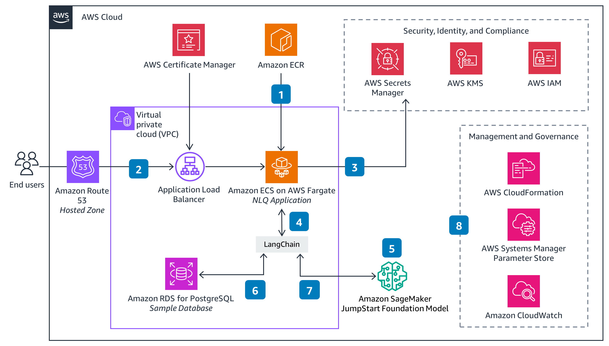
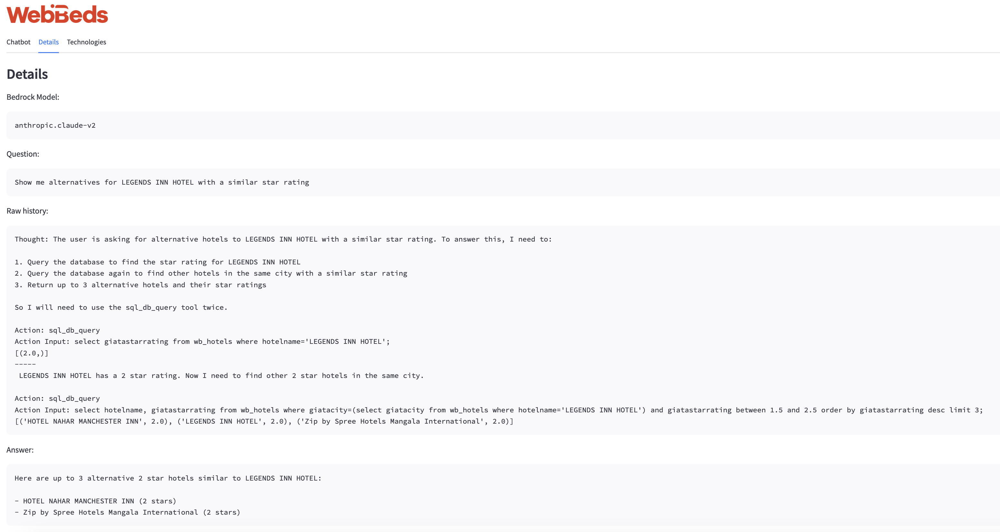
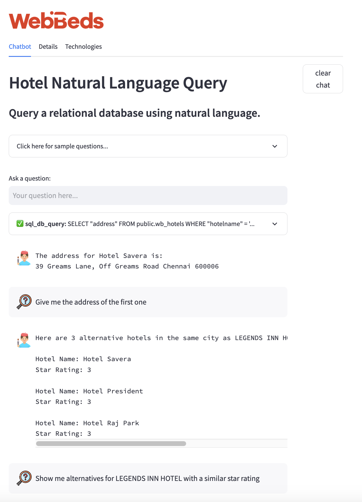

# Hotel Search using ReAct Prompting with Amazon Bedrock

This example implements a Reasoning & Acting ([ReAct](https://www.promptingguide.ai/techniques/react)) 
demonstration aimed at showcasing how an [Amazon Bedrock](https://aws.amazon.com/bedrock/)-powered
[🦜️🔗 LangChain agent](https://python.langchain.com/docs/modules/agents.html) can be used to
retrieve valuable information from a database implementing multiple steps and complex logic.

The example will use Anthropic Claude v2 as its LLM and implements the following techniques to improve
the performance of the system:

* [Langchain agents](https://python.langchain.com/docs/modules/agents.html).
* [Memory](https://python.langchain.com/docs/modules/memory/)
* Few-shot prompt customization for adding relevant example queries to the prompt 
  [using semantic search](https://python.langchain.com/docs/modules/model_io/prompts/example_selectors/similarity)
  beyond what's possible today with Langchain agents.
* Use of external tools for connecting to the DB.

Everything is presented in a very simple [Streamlit](https://streamlit.io/)-powered UI for easy of use.

[TOC]

# Requirements

In order to be able to use this solution, you must be enrolled in the Amazon Bedrock Private Preview and you must
have been granted access to the Anthropic Claude v2 suite of models.

The solution can be easily deployed to ECS + Fargate —as shown in the [architecture diagram](#architecture-and-flow)
below— using AWS CloudFormation with the templates found in [`cloudformation`](cloudformation).

You can also deploy the base components locally using Docker, please see [below](#running-locally) for details.

The code has been tested with Python 3.11 in GNU/Linux & macOS & has the following dependencies:

* `boto3` & `botocore` with Amazon Bedrock support. Please, be sure to use the `.whl` files from the Amazon Bedrock
  SDK, as the public versions of these packages do not include support for Bedrock.
* The requirements described in [`requirements.txt`](src/requirements.txt)

You can then run the code from the console:

```bash
cd src
streamlit run app.py
```

## Running locally

You can run a development environment locally using Docker:

1. Copy the `botocore` & `boto3` `.whl` files from the BedRock SDK into
   [`src/dependencies`](src/dependencies).
2. Modify the value of the `AWS_ACCESS_KEY_ID` & `AWS_SECRET_ACCESS_KEY` variables in 
   [`docker-compose.yml`](docker-compose.yml) for an account that has access
   to Bedrock.

You can then run the environment using:

```bash
docker compose up --build
```

You can further modify the behaviour of the application by setting environment
variables in [`docker-compose.yml`](docker-compose.yml). Of particular
interest is:

* `USE_AWS_PROFILE`: If present, the code will honour the normal `AWS_ACCESS_KEY_ID` &
  `AWS_SECRET_ACCESS_KEY` and related variables for the BedRock client. It will otherwise
  look for the credentials in AWS Secrets manager.

# Architecture and flow



# Code

The main application code is available in [`app.py`](src/app.py), here is a description of
some other parts of the code.

* [`assets`](src/assets): Includes YAML files for configuring the prompt prefix, format & suffix,
  but also for providing extra examples for the few-shot selector to choose from. The selected
  examples will be added to the prompt used by the agent.
* [`misc`](src/misc): Contains several config & I/O-related routines.
* [`prompts`](src/prompts) & [`agents`](src/agents) include useful extensions to Langchain developed
  for this project:
  - `DynamicPromptTemplate`: Extends Langchain's
    [`prompt templates`](https://python.langchain.com/docs/modules/model_io/prompts/prompt_templates/)
    so that callables passed as values for
    [partial prompt variables](https://python.langchain.com/docs/modules/model_io/prompts/prompt_templates/partial#partial-with-functions)
    will receive the conversation context (user input, chat history & agent scratchpad contents). This is
    needed for enabling the semantic search feature.
  - `DynamicConversationalAgent`: Extends Langchain's
    [`conversational agents`](https://python.langchain.com/docs/modules/agents/agent_types/chat_conversation_agent)
    to include support for `DynamicPromptTemplate`s, so that examples can be added to the prompt dynamically
    using semantic search.
  - `create_sql_agent` helper method that reimplements
    [Langchain's version](https://api.python.langchain.com/en/latest/agents/langchain.agents.agent_toolkits.sql.base.create_sql_agent.html)
    but supports
    [conversational agents](https://python.langchain.com/docs/modules/agents/agent_types/chat_conversation_agent).

# Screenshots

## Multi-step reasoning



## Agent with memory



# References

* [Amazon Bedrock](https://aws.amazon.com/bedrock/) provides API-based access to LLMs.
* [ReAct: Synergizing Reasoning and Acting in Language Models](https://arxiv.org/abs/2210.03629) describes the ReAct technique.
* [🦜️🔗 LangChain](https://python.langchain.com/docs/get_started/introduction.html) implements the ReAct technique.
* [Anthropic Claude v2](https://www.anthropic.com/index/claude-2) is used as the LLM.
* [Streamlit](https://streamlit.io/) powers the UI.
* [chroma](https://www.trychroma.com/) is used as the vector DB.
* This code derives from the code in the 
  [AWS Solution NLQ website](https://aws.amazon.com/solutions/guidance/natural-language-queries-of-relational-databases-on-aws/)
