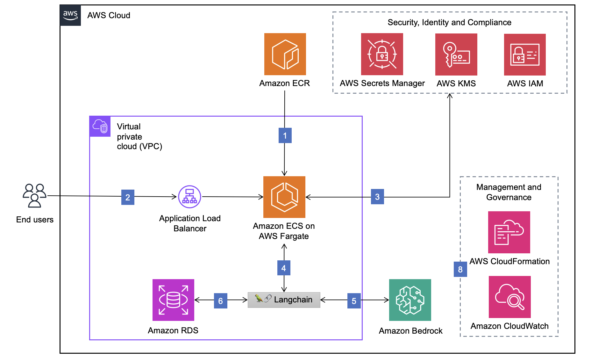
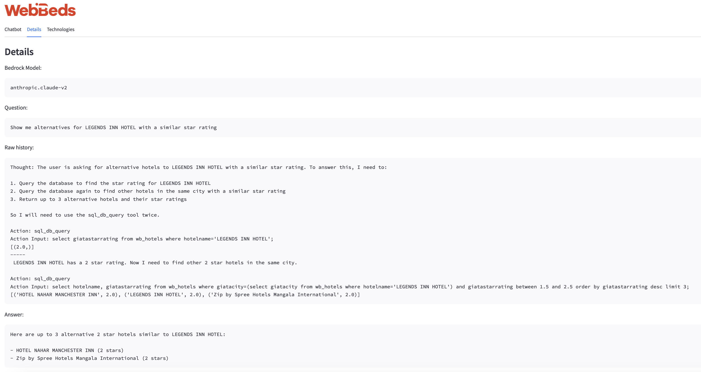
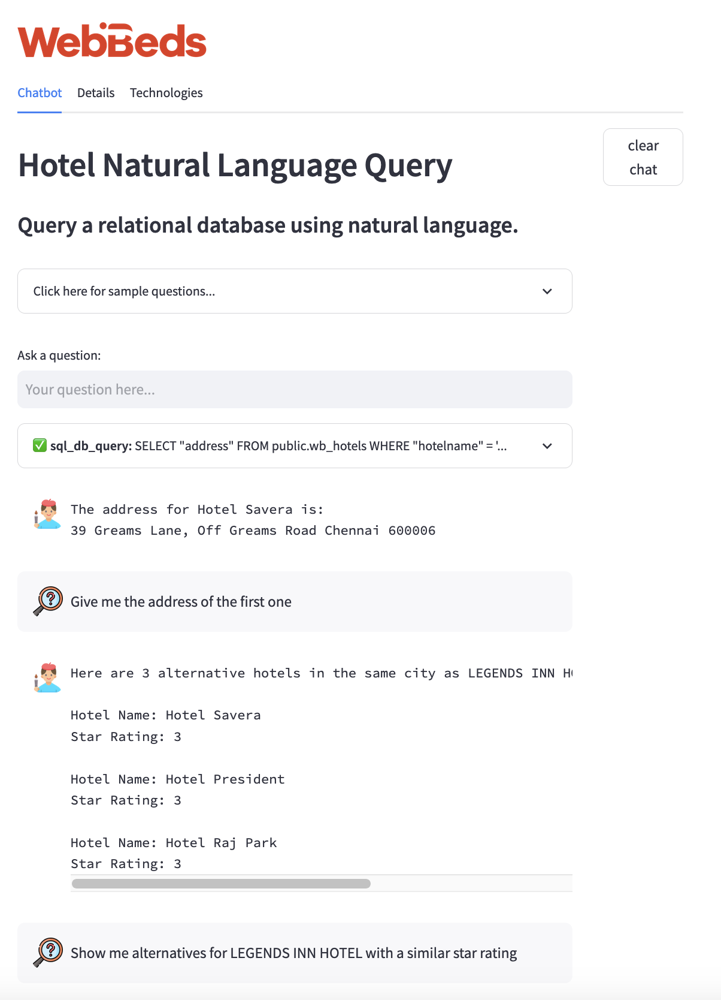

# Hotel Search using ReAct Prompting with Amazon Bedrock

This example implements a Reasoning & Acting ([ReAct](https://www.promptingguide.ai/techniques/react)) 
demonstration aimed at showcasing how an [Amazon Bedrock](https://aws.amazon.com/bedrock/)-powered
[🦜️🔗 LangChain agent](https://python.langchain.com/docs/modules/agents.html) can be used to
retrieve valuable information from a database implementing multiple steps and complex logic.

The example will use Anthropic Claude v2 as its LLM and implements the following techniques to improve
the performance of the system:

* [Langchain agents](https://python.langchain.com/docs/modules/agents.html).
* [Memory](https://python.langchain.com/docs/modules/memory/)
* Few-shot prompt customization for adding relevant example queries to the prompt 
  [using semantic search](https://python.langchain.com/docs/modules/model_io/prompts/example_selectors/similarity)
  beyond what's possible today with Langchain agents.
* Use of external tools for connecting to the DB.

Everything is presented in a very simple [Streamlit](https://streamlit.io/)-powered UI for easy of use.

# Running the application

The code can be run in AWS or in a local development environment as long as you have been
granted access to the Amazon Bedrock preview and have opted into using Anthropic's Claude
v2 models.

## In AWS with ECS + Fargate

### Requirements

Assuming that you will build the application image locally, you will need:

* Docker with support for running Linux containers (Docker Desktop will work just fine).

### Instructions

* Create the following plaintext secrets in AWS Secrets Manager:
  - `/nlq/MasterUsername`: master username for the RDS PostgreSQL database.
  - `/nlq/MasterUserPassword`: password for the master user.
  - `/nlq/bedrock_credentlals`: "other type of secret" with fields `access_key` and `secret_key`
    for using a specific account for Bedrock (the rest of the code will use the ECS Task role).
    If you do not wish to use separate credentials for Bedrock, set a `USE_AWS_PROFILE` environment
    variable for the ECS Task (with value `true`) and this secret will not be used.
* Deploy [`NlqMainStack.yaml`](cloudformation/NlqMainStack.yaml) to your account and desired
  region using AWS CloudFormation. Note the output value for the ECR repository URL, the
  load balancer URL & the name of the RDS database created by the template.
* Deploy the contents of [`wb_hotels.sql`](assets/wb_hotels.sql) to the RDS database created
  in the first step.
* Build the docker image for the application using the following script. Make sure to replace
  the ECR repository URL with the value from the output of the first step; also replace the
  container image tag if needed:

```bash
ECR_REPOSITORY_URL="[YOUR ECR REPOSITORY URL]"
REGION="[YOUR AWS REGION]"
IMAGE_TAG="1.0.0-bdrk"

cd src
aws ecr get-login-password --region $REGION | docker login --username AWS --password-stdin $ECR_REPOSITORY_URL
docker build -t $ECR_REPOSITORY_URL:$IMAGE_TAG .
docker push $ECR_REPOSITORY_URL:$IMAGE_TAG
```

* Deploy [`NlqEcsBedrockStack.yaml`](cloudformation/NlqEcsBedrockStack.yaml) using 
  AWS Cloudformation. Be sure to change the parameters for the image tags, if you
  changed it when building the image and for the image architecture so that it matches 
  the architecture you built the image for. 

Open a browser and point it to the load balancer URL from the first step, you should
see the Streamlit app after a few seconds.

## Locally with Docker

### Requirements

Please be sure to meet the following requirements:

1. Docker with support for running Linux containers (Docker Desktop will work just fine).
2. Copy the `botocore` & `boto3` `.whl` files from the BedRock SDK into
   [`src/dependencies`](src/dependencies). Please note that the regular `boto3` and `botocore` packages
   from pypi will not work since they do not include support for Bedrock yet. 
3. Modify the value of the `AWS_ACCESS_KEY_ID` & `AWS_SECRET_ACCESS_KEY` variables in 
   [`docker-compose.yml`](docker-compose.yml) for an account that has access
   to Bedrock.

### Instructions

Open a console in the main folder for this repo and execute:

```bash
docker compose up --build
```

Open [http://localhost:8501](http://localhost:8501) in your browser, you should see
the streamlit app start within a few seconds. The debugging output of the application
will be shown in the console where you executed the command above.

[`docker-compose.yml`](docker-compose.yml) will mount the local source folder as a volume
within the Docker container, so you can just start working on the local `src` folder
and changes will take effect immediately without needing to restart the containers.

### Cleanup

Just press `Control` + `C` in the terminal where the above command was run, the app
should stop within a few seconds.

## Locally without Docker

### Requirements

The code has been tested with python 3.11 in macOS 13.5.1 & GNU/Linux. It should work
in other systems, too.

You will also need:

1. Docker with support for running Linux containers (Docker Desktop will work just fine).
2. `botocore` & `boto3` from the BedRock SDK. Please note that the regular `boto3` and 
   `botocore` packages from pypi will not work since they do not include support for 
   Bedrock yet.
3. The requirements described in [`requirements.txt`](src/requirements.txt). You can
   install them with `pip install -r requirements.txt`.
4. A PostgreSQL DB with the data from [`wb_hotels.sql`](assets/wb_hotels.sql).

### Instructions

On a console, run the app. You can use the following example as a reference (be
sure to replace the placeholder values for the appropriate ones):

```bash
cd src
DB_URI=postgresql+psycopg2://[DB_USER]:[DB_PASSWORD]@[DB_URI]:[DB_PORT]/wb_hotels;USE_AWS_PROFILE=true streamlit run app.py
```

# Architecture and flow

The AWS Cloudformation stack will deploy the necessary components to get a scalable (albeit 
not production-ready) version of this application online. The architecture is described below:



# Code

The main application code is available in [`app.py`](src/app.py), here is a description of
some other parts of the code.

* [`assets`](src/assets): Includes YAML files for configuring the prompt prefix, format & suffix,
  but also for providing extra examples for the few-shot selector to choose from. The selected
  examples will be added to the prompt used by the agent.
* [`misc`](src/misc): Contains several config & I/O-related routines.
* [`prompts`](src/prompts) & [`agents`](src/agents) include useful extensions to Langchain developed
  for this project:
  - `DynamicPromptTemplate`: Extends Langchain's
    [`prompt templates`](https://python.langchain.com/docs/modules/model_io/prompts/prompt_templates/)
    so that callables passed as values for
    [partial prompt variables](https://python.langchain.com/docs/modules/model_io/prompts/prompt_templates/partial#partial-with-functions)
    will receive the conversation context (user input, chat history & agent scratchpad contents). This is
    needed for enabling the semantic search feature.
  - `DynamicConversationalAgent`: Extends Langchain's
    [`conversational agents`](https://python.langchain.com/docs/modules/agents/agent_types/chat_conversation_agent)
    to include support for `DynamicPromptTemplate`s, so that examples can be added to the prompt dynamically
    using semantic search.
  - `create_sql_agent` helper method that reimplements
    [Langchain's version](https://api.python.langchain.com/en/latest/agents/langchain.agents.agent_toolkits.sql.base.create_sql_agent.html)
    but supports
    [conversational agents](https://python.langchain.com/docs/modules/agents/agent_types/chat_conversation_agent).

# Points of improvement

The authors recognize the following points as potential points of improvement for the code:

* Adapt the PoC for more realistic scenarios involving reservations and not only hotel information.
* Add external relevant tools (geographical info, pricing information, booking handler…) by providing a suitable
  toolkit. Right now the code relies on Langchain's [`SQLDatabaseToolkit`](https://blog.langchain.dev/agent-toolkits/) 
  in [`app.py`](src/app.py) but a real use case will need more relevant tools.
* Add real-world few-shot samples in [`hotel_examples.yaml`](src/assets/hotel_examples.yaml).
* Prompt engineering: The general prompt needs adapting to a real-world example.
* Security: The agent will happily create destructive or otherwise unwanted queries (i.e: CPU-consuming or too 
  long queries), this should be limited.
* Ensure quality of responses: The agent will hallucinate responses given the appropriate input, but also long
  conversations will provide incorrect answers.
* Few shot example selector: The relevance threshold (configured in the `EMBEDDING_DISTANCE_THRESHOLD` param in 
  [`app.py`](src/app.py)) should be tweaked based on real-world examples, and the
  format for the generated prompt section might need tweaking.


# Screenshots

## Multi-step reasoning



## Agent with memory



# References

* [Amazon Bedrock](https://aws.amazon.com/bedrock/) provides API-based access to LLMs.
* [ReAct: Synergizing Reasoning and Acting in Language Models](https://arxiv.org/abs/2210.03629) describes the ReAct technique.
* [🦜️🔗 LangChain](https://python.langchain.com/docs/get_started/introduction.html) implements the ReAct technique.
* [Anthropic Claude v2](https://www.anthropic.com/index/claude-2) is used as the LLM.
* [Streamlit](https://streamlit.io/) powers the UI.
* [chroma](https://www.trychroma.com/) is used as the vector DB.
* This code derives from the code in the 
  [AWS Solution NLQ website](https://aws.amazon.com/solutions/guidance/natural-language-queries-of-relational-databases-on-aws/)
